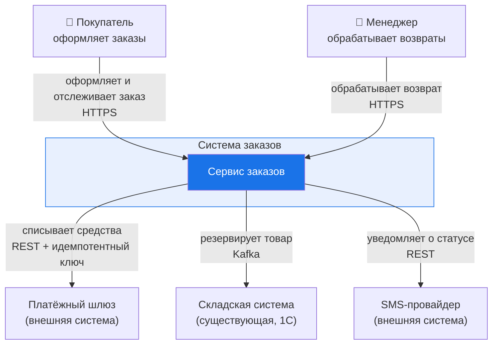
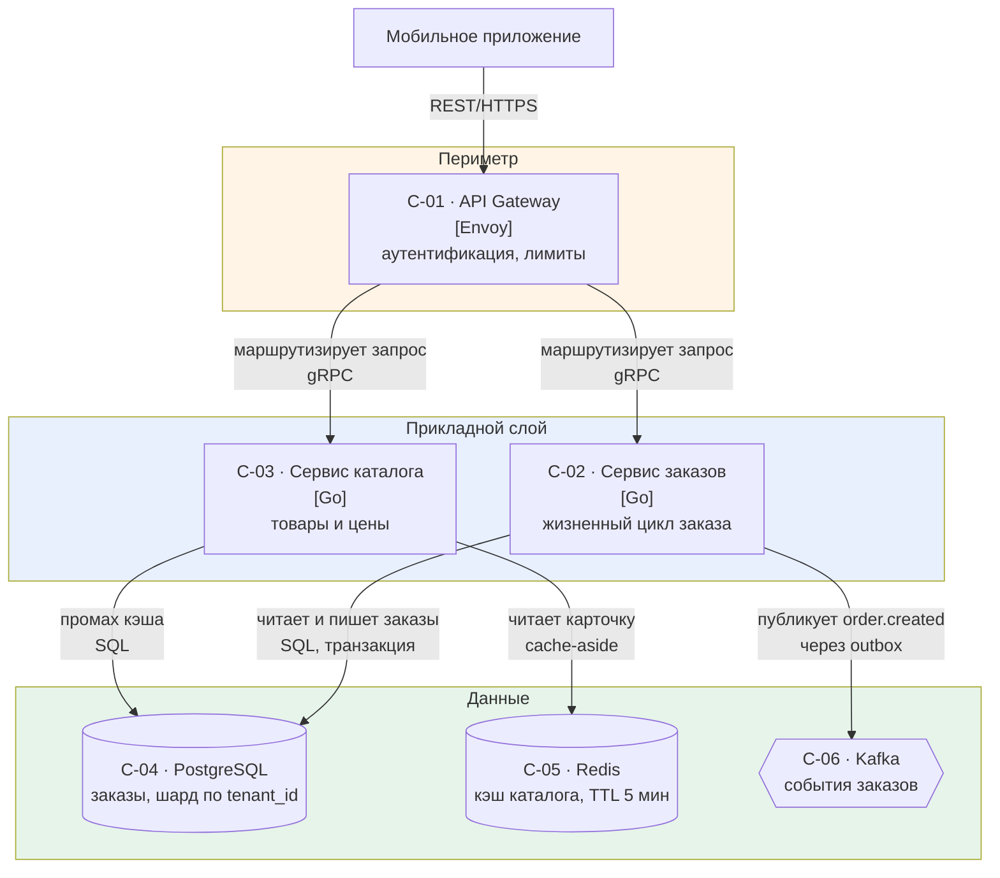
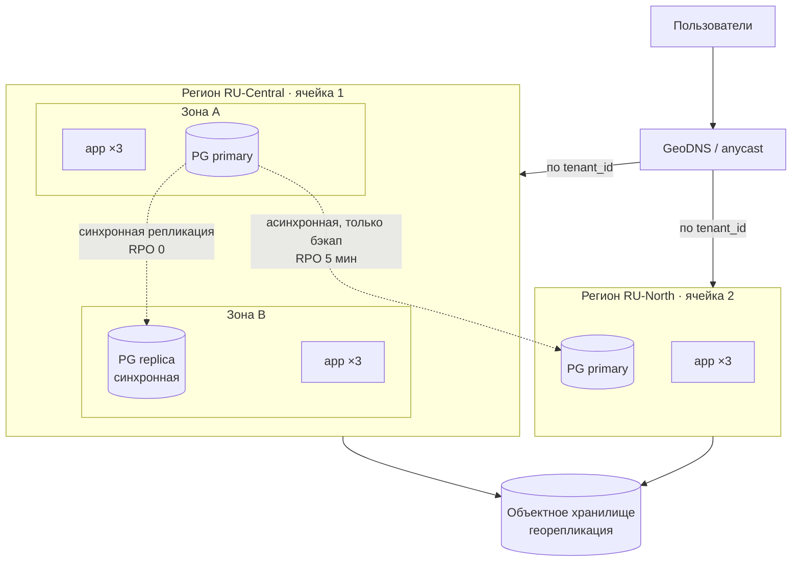
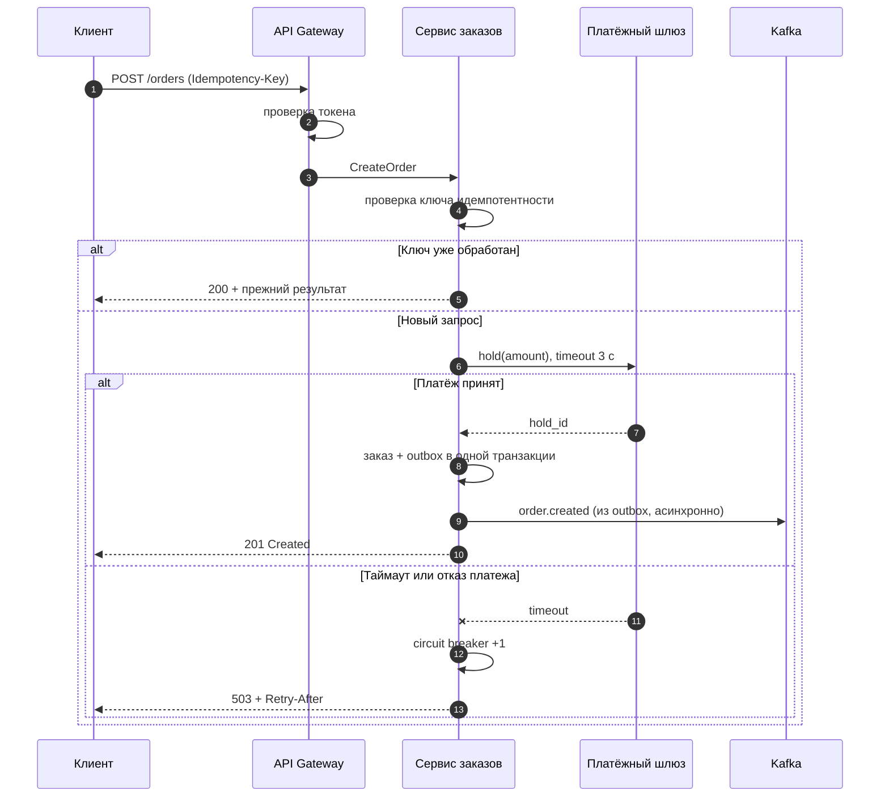
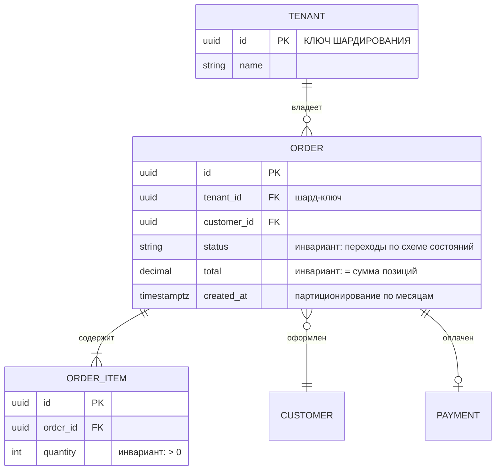
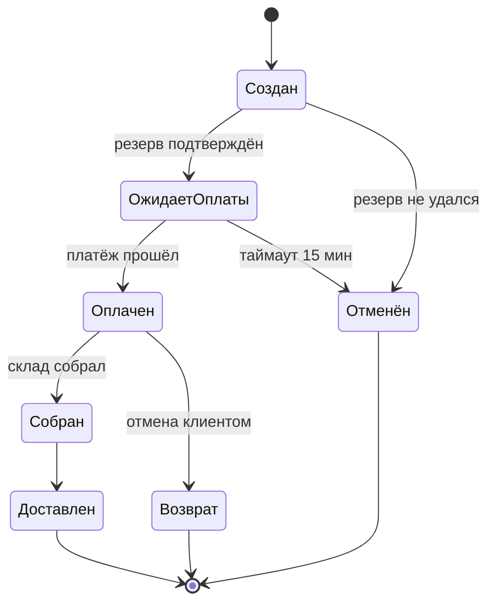

# Диаграммы

## Обязательный комплект

Дизайн не принимается, если отсутствует любая из диаграмм 1–5. Диаграммы 6–7 обязательны при наличии соответствующих требований.

| # | Диаграмма | Отвечает на вопрос | Обязательна |
|---|---|---|---|
| 1 | **C4 уровень 1 — контекст** | где границы системы, кто с ней взаимодействует | всегда |
| 2 | **C4 уровень 2 — контейнеры** | из чего состоит, как части связаны, по какому протоколу | всегда |
| 3 | **Топология развёртывания** | что где физически размещено: зоны, регионы, ячейки, репликация | всегда |
| 4 | **Sequence на каждый ключевой сценарий** | что происходит по шагам, включая ошибки и компенсации | по одной на каждый сценарий из требований |
| 5 | **Модель данных (ER)** | сущности, связи, ключ шардирования | всегда |
| 6 | **Матрица деградации** | что отказало → что перестало работать → что продолжает | при наличии внешних зависимостей |
| 7 | **Диаграмма состояний** | жизненный цикл сущности | если у ключевой сущности больше трёх состояний |

**Формат — Mermaid, встроенный в `system-design.md`.** Текстом, потому что версионируется в git, диффится при изменениях и проверяется машинно. Гейт G9 рендерит каждый блок; не отрендерилось — дизайн не принят.

---

## Общие правила

1. **Каждая стрелка подписана двумя вещами: «зачем» и «как».** «Запрашивает профиль пользователя / gRPC» — правильно. Стрелка без подписи — дефект.
2. **Направление стрелки — направление вызова**, а не потока данных. Для потока данных подписать явно.
3. **Никаких циклов** на диаграмме контейнеров. Цикл означает ошибку в границах.
4. **Внешние системы визуально отделены** от своих компонентов.
5. **Одна диаграмма — одна мысль.** Не сваливать несколько сценариев в одну sequence-диаграмму.
6. **Идентификаторы компонентов совпадают** с `C-NN` из карты компонентов — по ним гейт G8 сверяет архитектуру с кодом.
7. **Без деталей реализации** на уровнях 1–2: имена классов, версии библиотек, структура папок туда не попадают.

---

## Рецепты

### 1. Контекст (C4 L1)

### 2. Контейнеры (C4 L2)

### 3. Топология развёртывания

Обязательно показать: границы зон и регионов, что реплицируется и как (синхронно/асинхронно), где primary, куда идёт трафик при отказе.

### 4. Sequence с ветками ошибок

Обязательно: `autonumber`, хотя бы одна ветка `alt` с ошибкой, указание таймаутов на внешних вызовах.

### 5. Модель данных

Обязательно пометить ключ шардирования и ключевые инварианты.

### 6. Матрица деградации

Таблицей, не диаграммой — так читается лучше:

| Отказала зависимость | Что перестаёт работать | Что продолжает | Что видит пользователь | Восстановление |
|---|---|---|---|---|
| Платёжный шлюз | оплата заказа | просмотр каталога, корзина, история | «оплата временно недоступна, заказ сохранён» | автоматически по circuit breaker |
| Redis | — | всё, с ростом задержки на 30 мс | ничего | автоматически |
| Kafka | уведомления, синхронизация со складом | оформление заказа | ничего, уведомление придёт позже | outbox дошлёт |
| PostgreSQL primary | оформление и изменение заказов | просмотр из реплики | «оформление недоступно» | failover 30–60 с |
| Складская система | резервирование | всё остальное | заказ в статусе «ожидает подтверждения» | ретраи из очереди |

### 7. Состояния

---

## Чего в диаграммах быть не должно

- стрелок без подписи;
- компонентов без идентификатора `C-NN` на уровне контейнеров;
- «облачков» с надписью «микросервисы» вместо перечисления;
- смешения уровней: контейнеры и классы на одной схеме;
- диаграмм, которых нет в тексте документа — каждая сопровождается объяснением;
- цветов как единственного носителя смысла — подписи обязательны.

## Когда Mermaid не хватает

Для сложных топологий и больших карт компонентов допустимо **D2** или **PlantUML с C4-PlantUML** с рендером в SVG рядом с исходником. Исходник обязателен в репозитории — картинка без исходника не принимается, потому что не диффится и не поддерживается.
